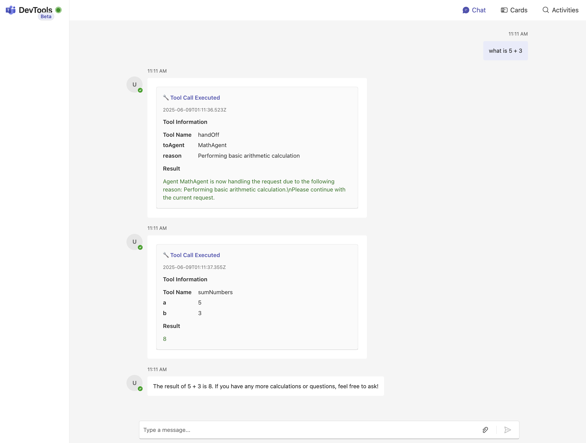

# Teams AI + Llamaindex Template 




A template for Microsoft Teams bot application that demonstrates multi-agent AI capabilities using Teams AI v2 and LlamaIndex workflows. The bot features specialized agents for mathematical calculations, text manipulation, and general assistance, all integrated with Microsoft Teams through adaptive cards and streaming responses.

## Features

### 🤖 Multi-Agent Architecture
- **Concierge Agent**: Main routing agent that handles general queries and routes specialized requests
- **Math Agent**: Performs mathematical calculations and operations
- **String Agent**: Handles text manipulation and string operations
- **Intelligent Routing**: Automatically routes requests to the appropriate specialized agent

### 🧮 Mathematical Operations
- Basic arithmetic (addition, subtraction, multiplication, division)
- Advanced operations (powers, square roots, modulo)
- Error handling for edge cases (division by zero, negative square roots)

### 📝 Text Manipulation
- Case conversion (uppercase, lowercase, title case)
- String operations (length, reverse, substring extraction)
- Text processing (replace, split, trim whitespace)

### 💬 Teams Integration
- Real-time streaming responses
- Adaptive cards for tool execution visualization
- Conversation history management
- Support for personal, team, and group chat scopes

### 🔧 Tool Execution Visualization
- Interactive adaptive cards showing tool calls
- Parameter display and execution results
- Expandable results for long outputs
- Timestamped execution logs

## Architecture

```
src/
├── index.ts              # Main application entry point
├── multi-agent.ts        # Multi-agent workflow configuration
├── chat-history.ts       # Conversation memory management
├── env.config.ts         # Environment configuration
├── concierge/            # Main routing agent
│   ├── agent.ts          # Concierge agent definition
│   ├── tools.ts          # Wikipedia tool integration
│   └── index.ts          # Module exports
├── math/                 # Mathematical operations agent
│   ├── agent.ts          # Math agent definition
│   ├── tools.ts          # Mathematical tools
│   └── index.ts          # Module exports
├── string/               # Text manipulation agent
│   ├── agent.ts          # String agent definition
│   ├── tools.ts          # Text processing tools
│   └── index.ts          # Module exports
└── cards/                # Adaptive cards for Teams
    └── tool-call.ts      # Tool execution visualization
```

## Prerequisites

- Node.js 18+ 
- Bun package manager
- OpenAI API key
- Microsoft Teams development environment

## Installation

1. Clone the repository:
```bash
git clone <repository-url>
cd teams_ai_demo
```

2. Install dependencies using Bun:
```bash
bun install
```

3. Set up environment variables:
```bash
cp .env.example .env
```

Edit `.env` and add your configuration:
```env
OPENAI_API_KEY=your_openai_api_key_here
PORT=3978
TEAMS_APP_ID=your_teams_app_id
BOT_ID=your_bot_id
BOT_DOMAIN=your_bot_domain
APP_NAME_SUFFIX=dev
```

## Development

### Running the Application

Start the development server:
```bash
bun run dev
```

## Usage

### Mathematical Operations

Ask the bot to perform calculations:
- "What is 15 + 27?"
- "Calculate the square root of 144"
- "What's 2 to the power of 8?"

### Text Manipulation

Request text processing operations:
- "Convert 'hello world' to uppercase"
- "What's the length of 'TypeScript'?"
- "Reverse the string 'programming'"

## Technology Stack

### Core Technologies
- **TypeScript**: Primary programming language
- **Node.js**: Runtime environment
- **Bun**: Package manager and build tool

### AI & Workflow
- **LlamaIndex**: AI workflow orchestration
- **OpenAI GPT-4**: Language model
- **Zod**: Type validation and schema definition

### Microsoft Teams Integration
- **@microsoft/teams.apps**: Teams application framework
- **@microsoft/teams.cards**: Adaptive cards for rich UI
- **@microsoft/teams.dev**: Development tools and plugins

### Development Tools
- **tsup**: TypeScript bundler
- **nodemon**: Development server with hot reload
- **dotenv**: Environment variable management

## Configuration

### Teams App Manifest

The `appPackage/manifest.json` configures the Teams application:
- App metadata and branding
- Bot capabilities and scopes
- Valid domains and permissions

### Agent Configuration

Each agent is configured with:
- **Name and Description**: For identification and routing
- **Tools**: Available functions the agent can execute
- **LLM Settings**: Model configuration and API keys
- **System Prompts**: Behavior and routing instructions
- **Handoff Capabilities**: Which agents can be called

## Error Handling

The application includes comprehensive error handling:
- **Mathematical Errors**: Division by zero, invalid operations
- **String Processing**: Boundary checks, invalid parameters
- **API Errors**: OpenAI API failures, network issues
- **Teams Integration**: Message delivery failures

## Contributing

1. Fork the repository
2. Create a feature branch: `git checkout -b feature/new-feature`
3. Make your changes and add tests
4. Commit your changes: `git commit -am 'Add new feature'`
5. Push to the branch: `git push origin feature/new-feature`
6. Submit a pull request

## License

This project is licensed under the MIT License - see the LICENSE file for details.

## Support

For questions and support:
- Check the [Microsoft Teams AI documentation](https://microsoft.github.io/teams-ai/welcome/)
- Review the [LlamaIndex documentation](https://ts.llamaindex.ai/docs/llamaindex)
- Open an issue in this repository 